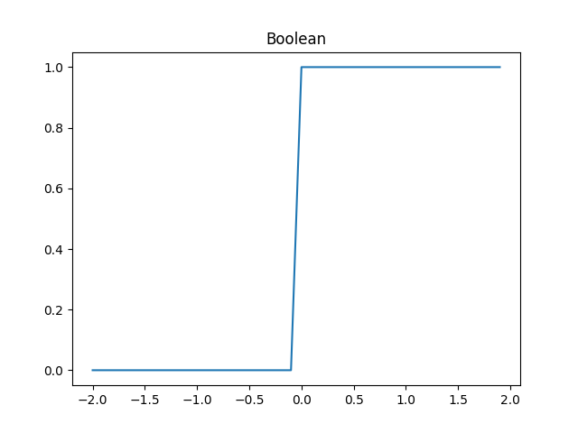

# Preference Specification Language

*Liz Yeiter & Robert Swanson*

This project defines a domain specific language (DSL) called PSL (preference specification language) to describe a set of requirements and preferences for a college student’s four year plan. A PSL file is translated by the PSL parser into a python file that evaluates a plan (encoded using JSON) according to the preferences and requirements defined. The data flow is diagramed below:


**Usage:**

The PSL parser is executed by compiling and executing `src/listener.java` and providing as two arguments the `.psl` input file and the full path (including name) to write the plan evaluator. For example:

```bash
java src/listener.java test-data/generator/input-good/good-integrated.psl test-data/generator/output/generated.py
```

The resulting plan evaluator can be called by providing the plan json file as an argument. For example:

```bash
python3 test-data/generator/output/generated.py test-data/evaluator/test-single-plan.json
```

The output will include information on the validity and the score of the plan. For example:

```
Valid Plan
Score: 100.00%	Weight: 5	Preference Name: COS 121, Given: True, Inverted: False
Score: 40.04%	Weight: 5	Preference Name: Prefer Start 9:00 AM, Given: 637.5, Optimum: 540 Inverted: False
Score: 98.78%	Weight: 10	Preference Name: Less classes with COS 120, Given: 7, Upper: 13, Lower: 17
Final Score: 84%
```

## Blocks

PSL files are composed of one or more labeled **blocks**. For example:

```
definitions {
	priority strongly 10.
	priority moderately 5.
	priority slightly 1.
}
```

This blocks is labeled `definitions`, which doesn’t mean anything to the system now, but could be used for imports in the future.

## Statements

The block body is made up of one or more **statements**. There are currently 5 types of statements:

1. Requirements: `require <requireable constraint>`
2. Preferences: `prefer <priority name> <constraint>`
3. Priority Definitions: `priority <name> <val>`
4. Condition Blocks: `if <condition> then { <block> }`
5. Context Blocks: `when <condition> then { <block> }`

**Requirements** specify constraints that a valid plan *must* satisfy. Requirements do not have any impact on the score of a plan, but only invalidate the plan if violated.

**Preferences** specify constraints that can be used to compare the desirability of one plan over another. When a preference is evaluated on a plan, it is scored as a percentage of its priority (defined below). The score of the entire plan is calculated a the sum of these scores divided by the maximum possible score (aka the sum of the priorities).

**Priority definitions** are used to link symbolic names to numeric weights for use with preference scoring. For example in the above code, preferences weighted `moderately` will have half as much impact on the plan score as preferences weighted `strongly`.

**Condition blocks** allow for the evaluation of a group of requirements and preferences only if a condition is met. For example, the following snippet demonstrates a requirement to take COS 121, only if taking COS 120, a preference otherwise if taking SYS 120, and otherwise a requirement to take COS 104.

```
if taking "COS 120" then {
	require "COS 121".
} otherwise if taking "SYS 120" {
	prefer moderately "COS 143".
} otherwise {
	require "COS 104"
}
```

If the condition is not met, the preferences and requirements contained have no impact on the validity or score of the plan.

Note: conditional blocks can be arbitrarily nested within other conditional blocks or context blocks without any problem.

**Context blocks** extend off conditions in that contained preferences and requirements are only evaluated if the condition is met, but differs in two distinct ways. First, the condition is not applied to the entire plan, but rather applied to every term within that plan. Second the requirements and priorities contained within the block only evaluates on a version of the plan that contains terms that met the condition. This version of the plan is called the current *context*, which is pushed to *context stack* when entering the scope of the when block, and popped off when leaving the scope.  For example, if only terms A and B met the condition, then any nested constraints will only look at terms A and B to evaluate. For example:

```
when taking "COS 421" then {
	prefer slightly less credits in semester.
}
```

This snippet indicates that the user prefers (with a weighting of "slightly”) to take less classes during terms when they are taking COS 421.

Just like conditional blocks, context blocks can be arbitrarily nested within other conditional or context blocks.

## Constraints

Prefer statements are able to operate on any kind of constraint. Constraints that are boolean can be scored as either 0% or 100% met, while continuous constraints can be partially met. However, requirements are either met or unmet, so some constraints cannot be required. Thus, there is a distinction between **constraints**, and a subset of those constraints which are called **requirable constraints**. Ever requirable constraint is a constraint, but not every constrain is a requirable constraint.

### Requirable Constraints

*Can use with `prefer` or `require`*

#### Num Credits Hours

```
120 credits in plan
120 hours in plan
17 credits in semester
17 hours in plan
```

The `credits` and `hours` tokens are always equivalent in meaning.

When required, this constraint indicates that at least the given number of credit hours exist in the current context. If this constraint is required, it makes no functional difference whether the `plan` token or the `semester` token is used.

When preferred, this constraint utilizes a optimization function centered at the provided value, and who’s deviance is controlled by whether the `plan` or `semester` tokens were used. This has the effect of providing a 100% score when there are the exact right number of credits, with a decreasing score as the number of credits deviates from the optimum.

#### Course List

```
"COS 120", "COS 121", "COS 143", "COS 243", "COS 265"
```

This constraint is boolean in nature whether preferred or required. It is met when all the courses from the provided course list are present in the current context.

#### $x$ of Course List

```
3 of "COS 120", "COS 121", "COS 143", "COS 243", "COS 265"
```

This constraint is boolean in nature whether preferred or required. It is met when at least $x$ courses from the provided course list are present in the current context.

#### $x$ Upper Division Hours

```
42 upper division credits
42 upper division hours
```

Again, credits and hours are equivalent in meaning.

When required, this constraint is met when at least $x$ credits from courses 200 level an above are in the current context.

When preferred, an optimization scoring function is used.

#### Left Before Right

```
taking "COS 120", "COS 121" before "COS 265"
```

Whether required or preferred, this constraint is met if the one or more courses on the left hand side occur before the one course on the right hand side.

### Non-requirable Constraints

*Can only use with `prefer`*

#### Earlier/Later Classes

```
later classes
later courses
earlier classes
earlier courses
```

The `class` token is equivalent in meaning to the `course` token.

This constraint is scored with a sigmoid function operating on the average class start time with the following parameters:

- `earlier`
  - Lower Bound: Soft, 2:00 PM
  - Upper Bound: Soft, 10:00 AM
- `later`
  - Lower Bound: Soft, 10:00 AM
  - Upper Bound: Soft, 2:00 PM

#### More/Less Courses

```
more classes in semester
less courses in plan
```

The `class` token is equivalent in meaning to the `course` token.

The `semester` token should be used if the current context is a semester and the `plan` token should be used if the current context is the whole plan.

This constraint is scored with a sigmoid function operating on the number of courses in the with the following parameters:

- `semester`
  - `more`
    - Greater Equal To 6, Deviance 2
  - `less`
    - Less Than Equal to 5, Deviance 2
- `plan`
  - `more`
    - Greater Equal To 48, Deviance 16
  - `less`
    - Less Than Equal to 40, Deviance 16

#### More/Less Credits

```
more credits in semester
less hours in plan
```

The `credits` token is equivalent in meaning to the `hours` token.

The `semester` token should be used if the current context is a semester and the `plan` token should be used if the current context is the whole plan.


This constraint is scored with a sigmoid function operating on the number of credits in the with the following parameters:

- `semester`
  - `more`
    - Greater Equal To 15, Deviance 2
  - `less`
    - Less Than Equal to 14, Deviance 2
- `plan`
  - `more`
    - Greater Equal To 145, Deviance 16
  - `less`
    - Less Than Equal to 144, Deviance 16

#### 

## Conditions

Conditions are passed into `if` and `when` statements to perform an evaluation on a particular context. Currently we only support conditions based on the existence of a course in a plan.

```
if taking "COS 121" then {
	...
}
when ((taking "COS 120" or taking "COS 121") and not taking "COS 143") then {
	...
}
```

Conditions can participate in arbitrary Boolean logic expressions including:

- `(<left> and <right>)`
- `(<left> or <right>)`
- `not <cond>`

Parenthesis are necessary when using `and` or `or` to disambiguate order of operations.

## Scoring

Preferences are scored as a percentage bounded from $0\%-100\%$ and then multiplied by the weight/priority passed to the `prefer` statement. This guarantees that a perfectly met constraint will have a score equivalent to the weight, a unmet constraint will have a score of 0, and partially met constraints will fall between. Mathematically stated, the score is evaluated according to the following equation:

$s=f(x)*w$

Where $s$ is the score, $f(x)$ is the evaluation of the scoring function, and $w$ is the weight of the preference. There are three functions this system uses to manipulate evaluations into the acceptable range:

1. Boolean
2. Sigmoid
3. Optimal

### Boolean

Boolean functions are the simplest of all, and are used to score constraints for preferences which are either met or unmet (eg `taking "COS 120”`).

$b(x)=\begin{cases} 0 & x \le0 \\ 1 & x > 0 \end{cases}$



It should only be passed values of either 0 or 1, but if it is passed anything else it behaves as demonstrated by the following graph, who’s y axis shows the value of $b(x)$ and who’s x-axis shows the value for $x$.

### Sigmoid

Sigmoid functions are used to score constraints for preferences in which the user is trying to maximize or minimize a value (eg `more credits`).

$s(x) = \frac 1 {1+9^{-x}}$


<small>[Desmos Link](https://www.desmos.com/calculator/onubzwbhmm)</small>

The value 9 was chosen because it made the function have the property that $s(-1)=\frac 1 4$ and $s(1)=\frac 3 4$, which would be useful for bounding purposes (described later).

### Optimal

Optimal functions are used to score constraints for preferences in which the user wants a value as close as possible to a certain value (eg `15 credits in semester`).

$o(x)=(\frac 1 4)^{x^2}$


<small>[Desmos Link](https://www.desmos.com/calculator/7zenmoxx18)</small>

The number $\frac 1 4$ was used because it made the optimal function have the property that $o(-1)=\frac 1 4$ and $o(1)=\frac 1 4$, which would be useful for bounding the function (described below).

### Bounds

There are cases in which a constraint will always be evaluated to a tight range of values, in this case it is an inefficiency of the system to only offer 75% scores for well-met constraints.

For this reason, a distinction from **soft bounds**  and **hard bounds** are made. The aforementioned equations represent the soft bound equations for sigmoid and for optimal functions because they taper off at a given point, rather than a hard cut off.

#### Hard Bound: Sigmoid

A sigmoid function using a hard bound becomes a bounded linear function.

$l(x)=\begin{cases} x & -1 \le x \le 1 \\ 0 & x < -1 \\ 1 & x > 1\end{cases}$


#### Hard Bound: Optimal

A optimal function using a hard bound becomes a bounded upside-down quadratic function.

$f(x)=\begin{cases} -x^2+1 & |x| \le 1 \\ 0 & |x| > 1 \end{cases}$


### Normalization

Both the sigmoid and the optimal function need to be modified to vary most significantly on the expected range of inputs.

The sigmoid function had two points at the 1^st^ and 3^rd^ quartiles which are used as base points. Inputs to the sigmoid function are thus normalized according to these two values using the following equation:

$n(x,l,u)=\frac {x-l} {u-l}$

This equation defines $l$ (lower) to be the input value that will score 25% and $u$ (upper) to be the input value that will score 75%. If $l > u$ then the function will give better scores to lower evaluations.

The optimal function had two points which describe the left and right quartiles, and also has a central optimum point that is defined. The following equation is used to normalize the evaluation:

$n(x,m,d)=\frac {x-m} d$

This equations defines a optimum point at $m$ (mean) and the left and right quartiles to be (respectively) $-d$ and $d$ (deviance).

With the combination of hard and soft bounds, each which can be provided their own parameters, it is possible to use different types of bounds for the two different points of a function. For example, this shows a optimum function where the optimum is 0.5, the left bound is a hard bound with a deviance of 2, and the right soft bound with deviance of 0.5.


